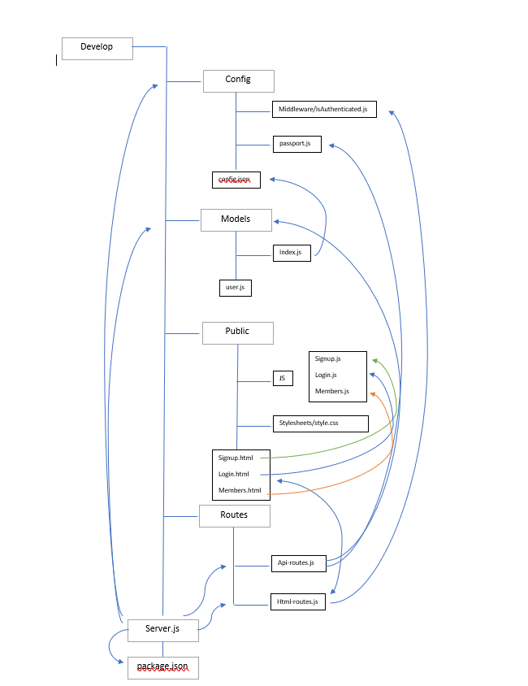

# Unit 14 Sequelize Homework: Reverse Engineering Code

# Walkthrough

1. WHEN user signs up for new account
2. THEN IF user successfully enters in a username and password
3. ELSE user will be redirected to the /members page.
4. ELSE IF user incorrectly fills out information
5. THEN user will remain on the page to try again.
6. IF A user exists
7. THEN the user can enter in their existing username and password

# Config
   * There exists config.json which contains several different environments that index.js from models will determine using process.env.NODE_ENV. If the environment is set it uses the set environment, otherwise it will manually create one.
   * Under middleware is isAuthenticated.js. This file checks for authentication of a user and redirects if not logged in.

# Models
 
   * index.js is in charge of going through all the data and setting the environment. It requires fs, path, sequelize, and config.json.
   * user.js defines fields, types, and information regarding the relevant table and database.
   
# Public
  * There are three html pages for the login, members, and signup features. Associated with these htmls pages are javascript files that equip each page with functionality.

# Routes
  * api-routes.js contains get and post requests that are build in Express methods that work with Authenticate to create user, logout a user, and obtain information about a user.

  * html-routes.js identify if a user is an authenticated user or if a user is signed up or if a user is logged out and redirects them to the correct html sites depending on specific conditions.

# Server
This is the initial starting point for Node and Express. This file sets up the Express app and handles data parsing. It requires config.json, express, passport, models, and both routes.

# Visual relation of files

# Changes that can be made
1. Adding a hint or second authorization step for when a user forgets their password. This can be done by adding another datapoint in the user.js file and then use the login.js/login.html page to display hints or alternative passwords. Then the api-route.js and html-routes.js would send the user to specific routes depending on if they were able to figure out their password.

## Business Context

When joining a new team, you will be expected to inspect a lot of code that you have never seen before. Rather than having a team member explain every line for you, you will dissect the code by yourself, saving any questions for a member of your team.

- - -
© 2019 Trilogy Education Services, a 2U, Inc. brand. All Rights Reserved.
